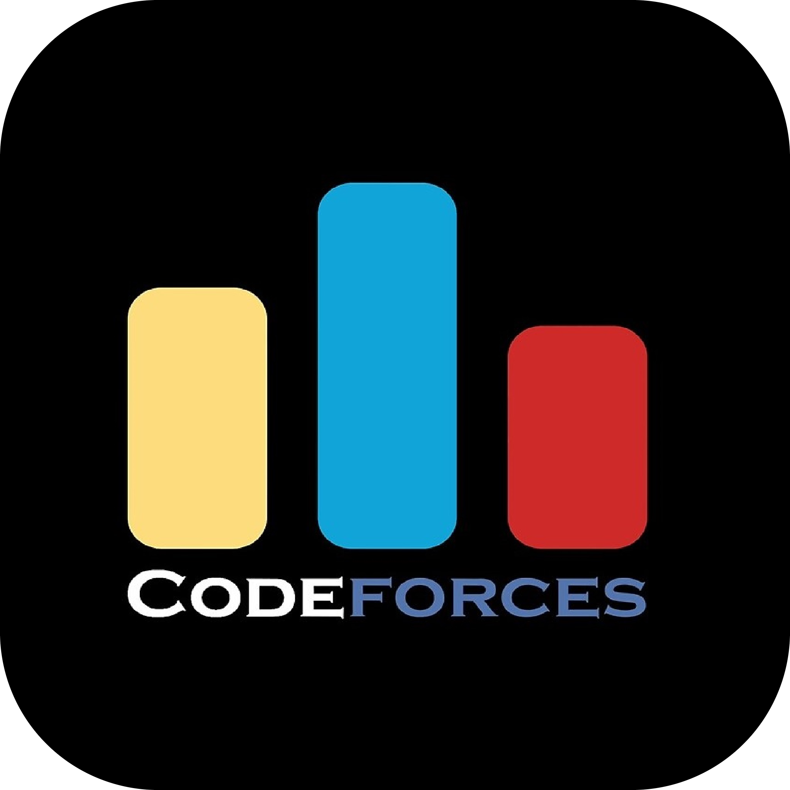

<section>
  

    <a href="https://judge.beecrowd.com/pt/profile/1041459"></img></a>
    <a href="https://www.hackerrank.com/profile/rafaelsepulveda1"></img></a>
    <a href="https://codeforces.com/profile/rafael_sepulveda"></img></a>
  

  

    </img>
    </img>
    
    
  

  

    </img>
    </img>
    </img>
    </img>
  

</section>

<h1 align="center">:zap: Rafael Sepulveda :zap:</h1>

<b>:mortar_board: 2° Semestre de Ciência da Computação na Universidade Paulista (UNIP)</b>

<section>
  <h2 align="center">Github Stats</h2>

  

    
  

</section>

<section>
  <h2 align="center">Top Langs</h2>

  

    
  

</section>

<section>
  <h2 align="center">Contact me</h2>

  

    
    
  

</section>
